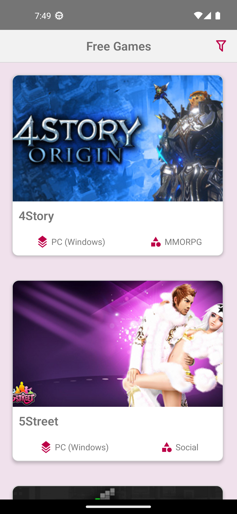

# FreeToGameApp
This project inspired by [chsdwn.](https://github.com/chsdwn/FreeToGameApp)

## Demo
https://github.com/ebubekirkarakurt/FreeToGameApp/assets/114517935/bc0c37d1-3cb5-4ed6-9ee0-50c5fe4ceedc

## ScreenShots

<div>
  <h3>List of Games </h3>
  
</div>
Loading

Filter Screen

Game Details Screen


## Installation

Install my-project with npm

```bash
  git clone https://github.com/ebubekirkarakurt/FreeToGameApp.git
  cd FreeToGameApp
```
Install NPM packages
 
```bash
  npm install
```
Start metro server
 
```bash
  npx react-native run-android
  or
  npx react-native run-ios
```
